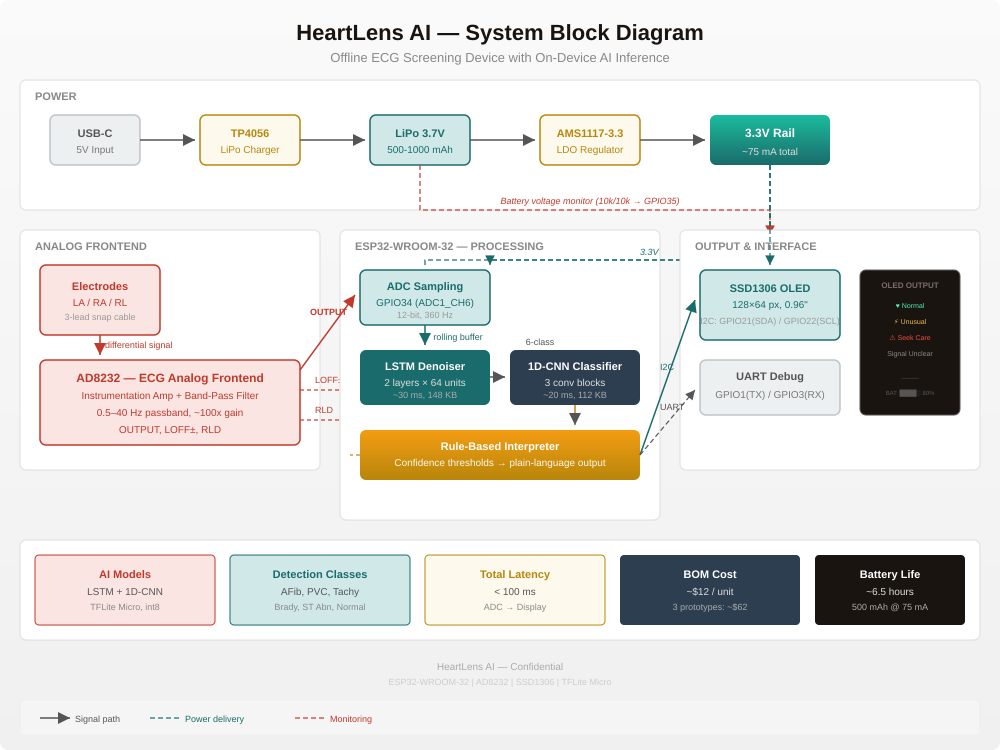

# HeartLens AI

**Edge ECG Monitoring with On-Device AI Inference**

A fully offline, sub-$15 ECG screening device that runs AI inference directly on the hardware — no smartphone, no internet, no medical training required.

> *"Every year, millions of people suffer preventable heart attacks not because treatment does not exist, but because warning signs went unnoticed until too late. HeartLens AI is built to close that gap — for anyone, anywhere, at a cost lower than a restaurant meal."*

---

## Overview

HeartLens AI captures an electrical signal from the skin surface (the same signal measured in hospital ECGs), cleans it using an AI denoiser running locally on the chip, classifies the rhythm pattern against 6 known cardiac conditions, and displays a plain-language result on a small screen. The entire process happens in under 100 milliseconds, with no data ever leaving the device.

| Parameter | Value |
|-----------|-------|
| Target BOM | ~$12 USD per unit |
| Connectivity | None — fully offline |
| MCU | ESP32-WROOM-32 (dual-core 240 MHz, 520 KB SRAM) |
| AI Models | LSTM denoiser + 1D-CNN classifier (TFLite Micro, int8) |
| Detects | AFib, PVC, Tachycardia, Bradycardia, ST abnormality, Normal |
| Build Timeline | 16 weeks (part-time) |
| License | MIT |

---

## Repository Structure

```
heart-lens/
├── README.md                          # This file
├── build_proposal.js                  # Node.js script to generate proposal .docx
├── circuit_diagram.md                 # Mermaid circuit diagram source
├── circuit_diagram.svg                # Rendered system block diagram
├── todo.md                            # Full project to-do list (16 weeks)
│
├── HeartLens_Firmware/                # ESP32 Arduino firmware
│   ├── README.md                      # Firmware-specific documentation
│   ├── HeartLens_Firmware.ino         # Main entry point
│   ├── setup_tflite_micro.sh          # Downloads TFLite Micro source
│   ├── convert_tflite_to_headers.sh   # .tflite → C header converter
│   ├── src/
│   │   ├── Config.h                   # Pin mapping, thresholds, constants
│   │   ├── adc_sampler.h/.cpp         # FreeRTOS ADC sampling at 360 Hz
│   │   ├── ecg_processor.h/.cpp       # TFLite Micro inference pipeline
│   │   ├── interpreter.h/.cpp         # Confidence → plain-language output
│   │   ├── display.h/.cpp             # SSD1306 OLED driver (I2C)
│   │   ├── battery.h/.cpp             # LiPo voltage monitoring
│   │   ├── lead_off.h/.cpp            # Electrode disconnect detection
│   │   └── debug.h                    # Toggleable serial debug
│   ├── models/
│   │   ├── denoiser_model.h           # int8 quantized denoiser (C array)
│   │   └── classifier_model.h         # int8 quantized classifier (C array)
│   └── lib/tensorflow_lite/           # TFLite Micro source (25 MB)
│
├── heart-lens-training/               # Python training pipeline
│   ├── TRAINING_DATA.md               # MIT-BIH dataset statistics
│   ├── data_loader.py                 # WFDB parser, segment extraction
│   ├── noise_pipeline.py              # 4 noise types + SNR mixing
│   ├── train_denoiser.py              # LSTM autoencoder training
│   ├── train_classifier.py            # 1D-CNN classification training
│   ├── quantize.py                    # Standalone int8 quantization
│   ├── generate_dummy_models.py       # Dummy models for firmware bringup
│   ├── models/
│   │   ├── denoiser_dummy.tflite      # 3.6 KB dummy denoiser
│   │   └── classifier_dummy.tflite    # 12.6 KB dummy classifier
│   └── mitdb/                         # MIT-BIH Arrhythmia Database (downloaded)
│
└── HeartLens_AI_Project_Proposal.*    # Generated proposal document
```

---

## Hardware

### Block Diagram



### Pin Mapping

| ESP32 Pin | Connects To | Function |
|-----------|-------------|----------|
| GPIO34 | AD8232 OUTPUT | ECG signal (ADC1_CH6) |
| GPIO32 | AD8232 LOFF+ | Lead-off detect positive |
| GPIO33 | AD8232 LOFF- | Lead-off detect negative |
| GPIO21 | SSD1306 SDA | I2C data |
| GPIO22 | SSD1306 SCL | I2C clock |
| GPIO35 | Battery divider (10k/10k) | LiPo voltage monitor |
| GPIO2 | Built-in LED | Status |
| GPIO1/3 | UART | Debug serial (115200 baud) |

### Bill of Materials

| Component | Model | Cost |
|-----------|-------|------|
| Microcontroller | ESP32-WROOM-32 | $3.50 |
| ECG Analog Frontend | AD8232 breakouts | $2.00 |
| Display | SSD1306 OLED 128×64 I2C | $1.50 |
| Electrodes | Snap cable + gel pads | $1.50 |
| Battery | LiPo 500–1000 mAh 3.7V | $1.50 |
| Charger | TP4056 USB-C | $0.50 |
| PCB | Custom 2-layer 60×40 mm | $0.40 |
| Passives | Resistors, caps, headers | $1.00 |
| **Total** | | **~$11.90** |

### Power Budget

| Component | Current |
|-----------|---------|
| ESP32 (active, 240 MHz) | ~60 mA |
| AD8232 | ~0.5 mA |
| SSD1306 (average) | ~10 mA |
| AMS1117 quiescent | ~5 mA |
| **Total** | **~75 mA** |
| **Battery life (500 mAh)** | **~6.5 hours** |

---

## Firmware

### State Machine

```
         ┌──────────────────────────────────────┐
         │                                      ▼
    ┌────────┐  lead_off   ┌──────────┐  full  ┌───────────┐
    │  IDLE  │───────────▶│ SAMPLING │──────▶│ INFERENCE │
    └────┬───┘            └──────────┘        └─────┬─────┘
         ▲                                          │
         │                ┌──────────┐               │
         │                │ DISPLAY  │◄──────────────┘
         │                └────┬─────┘
         │                     │ 10s timeout
         └─────────────────────┘
```

### Inference Pipeline

1. **ADC Sampling** (Core 0, 360 Hz) — 10-second window (3,600 int16 samples)
2. **Denoiser** (LSTM autoencoder, int8, ~148 KB) — removes motion artifacts, baseline wander, PLI, EMG noise
3. **Classifier** (1D-CNN, int8, ~112 KB) — outputs 6-class probability vector
4. **Interpreter** (rule-based) — confidence thresholds → 1 of 4 plain-language messages
5. **Display** (SSD1306 OLED) — shows result + battery indicator

### Plain-Language Outputs

| Condition | Message |
|-----------|---------|
| Normal | "Heart rhythm looks normal." |
| Medium urgency | "Unusual rhythm detected. Please see a doctor soon." |
| High urgency | "Irregular rhythm detected. Please seek medical attention." |
| Unclear signal | "Signal unclear. Please reattach electrodes and try again." |

### Quick Start

```bash
cd HeartLens_Firmware
./setup_tflite_micro.sh                    # Download TFLite Micro (25 MB)

# Open HeartLens_Firmware.ino in Arduino IDE
# Install: ESP32 board package, Adafruit SSD1306, Adafruit GFX
# Select Board: ESP32 Dev Module
# Upload
```

---

## Training Pipeline

### Dataset

The model is trained on the **MIT-BIH Arrhythmia Database** (PhysioNet) — 48 half-hour ECG recordings at 360 Hz.

| Class | Name | Segments |
|-------|------|----------|
| 0 | Normal Sinus Rhythm | 29,851 |
| 1 | Atrial Fibrillation | 705 |
| 2 | Premature Ventricular Contraction | 2,227 |
| 3 | Tachycardia | 455 |
| 4 | Bradycardia | 2,556 |
| 5 | ST Abnormality | 70 |
| **Total** | | **35,864** |

### Model Architectures

**Denoiser** (LSTM autoencoder):
- Input: 360 samples × 1 channel (1 second at 360 Hz)
- 2 LSTM layers (64 units each, return sequences)
- TimeDistributed Dense output
- Loss: MSE on clean ECG reconstruction
- Quantized size: ~148 KB (target)

**Classifier** (1D-CNN):
- Input: 360 samples × 1 channel (denoised)
- 3 Conv1D blocks: 32/64/128 filters, kernel 5, BatchNorm, MaxPool
- Global Average Pooling → Dense(64, ReLU) → Dropout(0.5) → Dense(6, Softmax)
- Quantized size: ~112 KB (target)

### Training

```bash
cd heart-lens-training
python3 data_loader.py                  # Download MIT-BIH & extract segments
python3 train_denoiser.py               # Train denoiser → int8 TFLite
python3 train_classifier.py             # Train classifier → int8 TFLite
./convert_tflite_to_headers.sh          # Update firmware C headers
```

Dummy models are provided for firmware bringup (no dataset required):
```bash
python3 generate_dummy_models.py        # Creates placeholder .tflite files
```

### Noise Augmentation

The noise pipeline generates 7 SNR levels (0, 5, 10, 15, 20, 30, 40 dB) for each clean segment, combining:
- **Baseline wander** — 0.1–0.5 Hz low-frequency drift
- **Motion artifact** — random step/impulse events with exponential decay
- **Power-line interference** — 50 Hz sinusoid
- **EMG noise** — 20–100 Hz band-passed white noise

---

## Project Timeline (16 Weeks)

| Sprint | Weeks | Theme | Key Deliverable |
|--------|-------|-------|-----------------|
| Sprint 1 | W1–W3 | Hardware & Signal Acquisition | Prototype board, clean ECG on scope |
| Sprint 2 | W4–W7 | Data Pipeline & Model Training | Both models trained & quantized |
| Sprint 3 | W8–W10 | Firmware Integration | Full pipeline on ESP32 <100 ms |
| Sprint 4 | W11–W13 | Noise Study & Feasibility Testing | Real-world accuracy benchmarks |
| Sprint 5 | W14–W16 | Documentation & Publication | Paper submitted, code open-sourced |

See [`todo.md`](todo.md) for the full task breakdown.

---

## License

MIT — See [LICENSE](LICENSE) (if present) or the project root.

---

## Publication Targets

| Venue | Type | Impact Factor |
|-------|------|---------------|
| Sensors (MDPI) | Primary | Q2, IF ~3.9 |
| IEEE Internet of Things Journal | Alternate | Q1, IF ~10.6 |
| Biomedical Signal Processing & Control | Alternate | Q1, IF ~5.1 |
| IEEE EMBC | Conference backup | Top-tier |

---

## Regulatory Scope

HeartLens AI is a **preventative screening aid**, not a medical device. It is not intended to diagnose, treat, or manage any condition. Its sole function is to flag rhythm patterns that may warrant professional evaluation.
