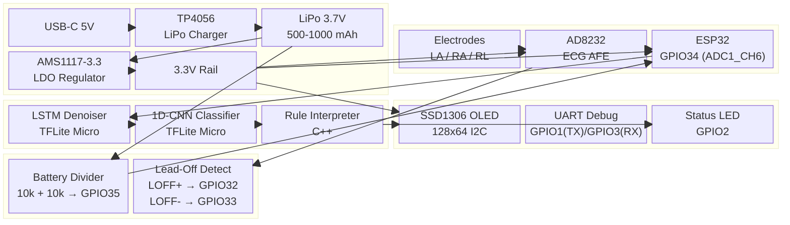

# HeartLens AI — System Circuit Diagram

## Pin Connection Table

| Component | Pin | Connects To | Notes |
|-----------|-----|-------------|-------|
| Electrode LA | — | AD8232 IN+ | Positive differential input |
| Electrode RA | — | AD8232 IN- | Negative differential input |
| Electrode RL | — | AD8232 RLD | Right-leg drive output |
| **AD8232** | OUTPUT | ESP32 GPIO34 | Filtered ECG signal (0.5-2.5V) |
| | LOFF+ | ESP32 GPIO32 | Lead-off detect positive |
| | LOFF- | ESP32 GPIO33 | Lead-off detect negative |
| | VCC | 3.3V rail | 100nF decoupling to GND |
| **SSD1306** | SDA | ESP32 GPIO21 | I2C data, 4.7k pull-up |
| | SCL | ESP32 GPIO22 | I2C clock, 4.7k pull-up |
| | VCC | 3.3V rail | 100nF decoupling |
| **TP4056** | VIN | USB-C VBUS | 5V charging input |
| | VOUT+ | LiPo BAT+ | 4.2V max |
| **AMS1117** | VIN | LiPo BAT+ | Input voltage |
| | VOUT | 3.3V rail | Regulated 3.3V |
| **Battery Divider** | — | ESP32 GPIO35 | 10k/10k divider |
| **ESP32** | EN | 10k pull-up to 3.3V | Reset button |

## Power Budget

| Component | Current (mA) |
|-----------|-------------|
| ESP32 (active, dual-core) | ~60 |
| AD8232 | ~0.5 |
| SSD1306 (average) | ~10 |
| AMS1117 quiescent | ~5 |
| **Total** | **~75 mA** |
| **Battery life (500 mAh)** | **~6.5 hours** |
